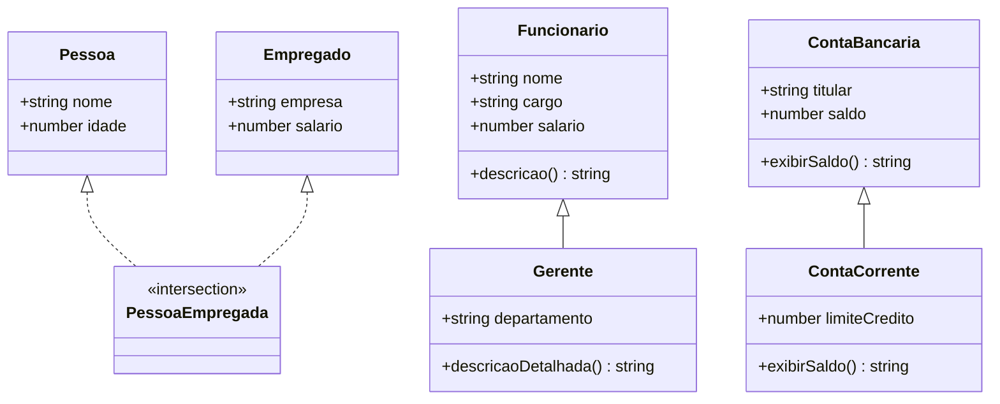

# FIAP - Engenharia de Computação - Checkpoint 4 🎓🚀
### Advanced Programming Mobile Developer - TypeScript Deep Dive

[](https://www.typescriptlang.org/)
[](https://nodejs.org/)
[](https://opensource.org/licenses/MIT)

Repositório técnico contendo a implementação padronizada, modular e fortemente tipada dos exercícios do **Checkpoint 4** da disciplina de *Advanced Programming Mobile Developer* (3º ano de Engenharia de Computação - FIAP).

O projeto aborda conceitos fundamentais e avançados do ecossistema TypeScript:
- **Interfaces e Tipos de União** (*Union Types*)
- **Interseção de Tipos** (*Intersection Types*)
- **POO, Herança e Polimorfismo** (*Method Overriding & Encapsulation*)
- **Módulos ES6 vs Namespaces**
- **Generics com Restrições de Tipo** (*Generic Constraints*)
- **Decorators de Método** (*Method Decorators / Metaprogramming*)
- **Custom Error Handling** (*Tratamento de Exceções com Hierarquia de Erros*)
- **Assincronismo com Promises e Async/Await**

---

## 🏛️ Arquitetura e Estrutura de Diretórios

```
Checkpoint_4---Frontend/
├── exercicio_1/                    # Módulo 1: Fundamentos de Tipagem e POO
│   ├── Cliente.ts                  # Entidade de domínio Cliente
│   ├── Pedido.ts                   # Entidade Pedido com injeção de dependência de Cliente
│   ├── Exercicio1.ts               # Interfaces e Union Types (Produto & FormaPagamento)
│   ├── Exercicio2.ts               # Intersection Types (Pessoa & Empregado)
│   ├── Exercicio3.ts               # Herança de Classes (Funcionario & Gerente)
│   ├── Exercicio4.ts               # Polimorfismo e Sobrescrita (ContaBancaria & ContaCorrente)
│   ├── Financeiro.ts               # Encapsulamento com Namespace TypeScript
│   ├── Main.ts                     # Runner de validação do módulo Financeiro
│   └── Principal.ts                # Entrypoint de integração Cliente/Pedido
├── exercicio_2/                    # Módulo 2: Recursos Avançados de TypeScript
│   ├── GenericF.ts                 # Função genérica com restrição <T extends number | string>
│   ├── medirTempoDeExecucao.ts     # Decorator de método para telemetria de execução
│   ├── verificarEmail.ts           # Exceção customizada (EmailInvalidoError)
│   └── buscarDadosDaAPI.ts         # Consumo assíncrono simulado com tipagem de resposta
├── tsconfig.json                   # Configuração estrita do compilador TypeScript
├── package.json                    # Scripts e metadados de execução
├── .gitignore                      # Exclusão de node_modules, dist/ e artefatos locais
└── README.md                       # Documentação técnica detalhada
```

---

## 📐 Diagrama de Classes e Relações



---

## 📚 Detalhamento dos Conceitos Implementados

### 1. Interfaces e Union Types (`Exercicio1.ts`)
Demonstra o desacoplamento de contratos de dados através de `interface Produto` e a restrição de valores de pagamento aceitos via união de literais `'dinheiro' | 'cartão' | 'pix'`, garantindo validação estática em tempo de compilação sem custos adicionais em runtime.

### 2. Intersection Types (`Exercicio2.ts`)
Combina múltiplos tipos estruturais (`Pessoa` e `Empregado`) em um único tipo `PessoaEmpregada = Pessoa & Empregado`. Permite composição flexível sem a rigidez de herança múltipla.

### 3. Herança e Modificadores de Parâmetro (`Exercicio3.ts`)
Utiliza sintaxe concisa de construtor do TypeScript (`public nome: string`) para declarar e inicializar atributos automaticamente. A subclasse `Gerente` estende `Funcionario` e invoca `super()` para reutilização de comportamento.

### 4. Polimorfismo e `override` (`Exercicio4.ts`)
Implementa sobrescrita controlada do método `exibirSaldo()` na classe `ContaCorrente`, adicionando o limite de crédito ao saldo total disponível.

### 5. Namespaces vs ES Modules (`Financeiro.ts`, `Cliente.ts`, `Pedido.ts`)
- **Namespaces**: Agrupamento lógico interno via palavra-chave `namespace`, ideal para bibliotecas legadas ou empacotamento de funções utilitárias sem poluir o escopo global.
- **ES Modules**: Padrão moderno da indústria com `export` e `import` pontuais, proporcionando melhor suporte a *tree-shaking* e empacotadores modernos (Webpack, Vite, Rollup).

### 6. Generic Constraints (`GenericF.ts`)
Implementa a função `encontrarMaiorElemento<T extends number | string>(array: T[]): T`:
- O parâmetro de tipo `T` é restrito a aceitar apenas tipos comparáveis (`number` ou `string`).
- Garante segurança de tipo ao manipular arrays numéricos ou arrays de strings com ordenação lexicográfica (ASCII/Unicode).

### 7. Method Decorators (`medirTempoDeExecucao.ts`)
Utiliza metaprogramação através de decorators experimentais do TypeScript para interceptar métodos de classe em tempo de execução, injetando cronômetros de medição de desempenho (`console.time` / `console.timeEnd`) de forma transparente e desacoplada da lógica de negócio.

### 8. Custom Error Classes (`verificarEmail.ts`)
Criação da classe `EmailInvalidoError extends Error` com redefinição de protótipo (`Object.setPrototypeOf`), permitindo verificação refinada através de `instanceof` dentro de blocos `try/catch`.

### 9. Async/Await & Typed Promises (`buscarDadosDaAPI.ts`)
Padrão robusto para chamadas assíncronas com tratamento de erros `try/catch`, tipagem estrita de retorno com `Promise<RespostaAPI>` e diferenciação segura entre instâncias de `Error` e falhas imprevistas.

---

## 🛠️ Como Executar

### Pré-requisitos
- [Node.js](https://nodejs.org/) (versão 18 ou superior)
- [npm](https://www.npmjs.com/) ou [yarn](https://yarnpkg.com/)

### Instalação de Dependências
```bash
npm install
```

### Compilação do TypeScript
Para compilar todo o projeto para JavaScript (gerando a pasta `dist/`):
```bash
npm run build
```

Para manter o compilador monitorando alterações em tempo real:
```bash
npm run watch
```

### Execução dos Exercícios
```bash
# Executar integração Cliente/Pedido
npm run run:ex1

# Executar função genérica
npm run run:ex2-generic

# Executar medição por decorator
npm run run:ex2-decorator

# Executar simulação de API assíncrona
npm run run:ex2-api
```

---

## 👨‍💻 Autoria
Desenvolvido por **Guilherme Macario da Silva** no âmbito do curso de Engenharia de Computação da **FIAP**.
